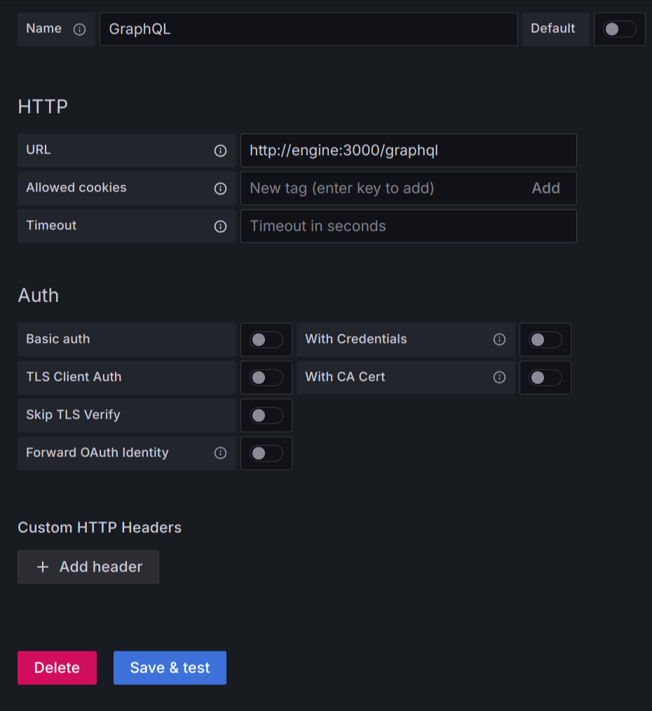
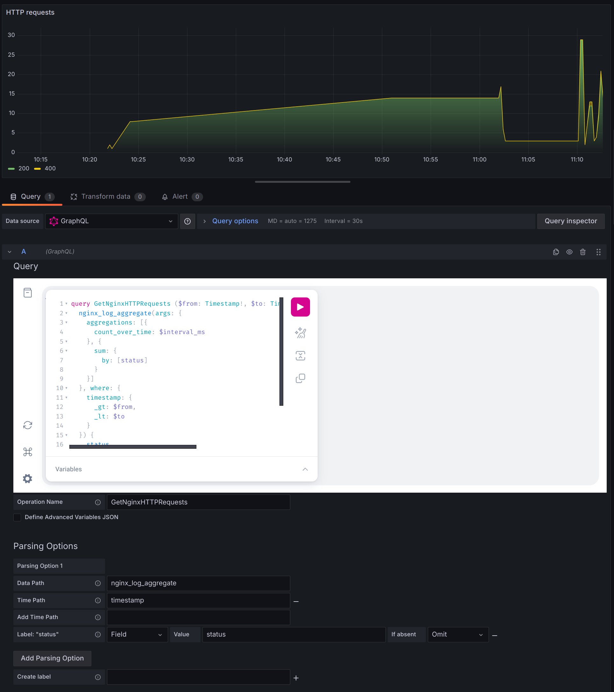
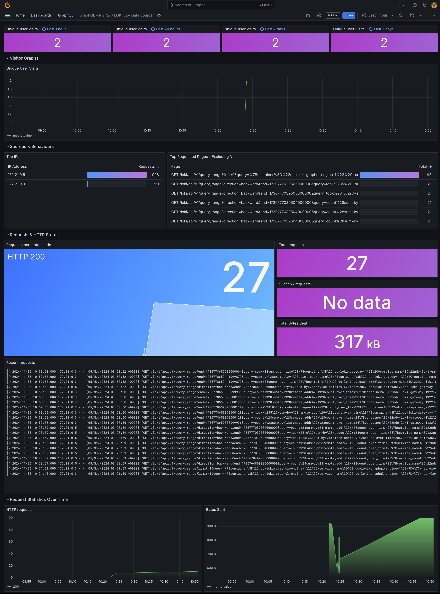

# Integrate Loki Connector with Grafana

## Why use Loki Connector with Grafana?

The [Loki data source](https://grafana.com/docs/grafana/latest/datasources/loki/) is still the best choice to query and visualize Loki data in Grafana. However, it lacks of Authz features to control access control permissions for Grafana users, for example, a user is allowed to query several log types with the `user_id` label equal the current user ID. That's the missing field that Hasura DDN and Loki connector can support.

## Use GraphQL data source

### Connector configuration

Grafana can query GraphQL data using the [Wild GraphQL Data Source](https://grafana.com/grafana/plugins/retrodaredevil-wildgraphql-datasource/). The connector is compatible with this plugin with some runtime configuration:

- `flat=true`: the plugin expects query results to be flat objects in the root array.
- `unix_time_unit=ms`: `from`, `to` unix timestamps and `interval_ms` duration variable values are numbers with the millisecond unit. This setting will decode all timestamp and duration parameters to the same unit.
- `format.value=float64`: the time series value must be a float number.

```yaml
# ...
runtime:
  flat: true
  unix_time_unit: ms
  format:
    timestamp: unix_ms
    value: float64
    nan: null
    inf: "+Inf"
    negative_inf: "-Inf"
```

### Grafana configuration

First, you need install the `Wild GraphQL Data Source` plugin and create a connection to the GraphQL endpoint of the Hasura engine v3.



The plugin supports many authentication strategies: Basic, Bearer, Cookie, TLS or Forward OAuth identity (access token). You can configure one of them and the plugin will forward authorization credentials to the GraphQL server.

Now you can query GraphQL data, parse the time-series array, timestamp and labels from the response. See the docs of [Wild GraphQL Data Source](https://grafana.com/grafana/plugins/retrodaredevil-wildgraphql-datasource/) to know how to use it.



## Examples

Clone this repository and start the demo:

```sh
make start
```

Browse the Grafana UI at http://localhost:3001 to view dashboards in the GraphQL folder. Both username and password are `admin`.


